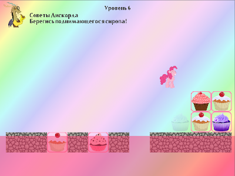
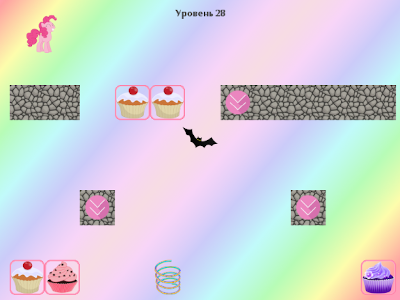

# Простая аркадная игра про приключения Пинки Пай

## О проекте

Задача игры - управляя прыжками Пинки Пай, сьесть все кексики на уровне, избежать всех опасностей и
не провалиться за пределы экрана. Реализованы 30 уровней.

 

Проект разработан на языке ObjectPascal в IDE Delphi 10, в качестве графической библиотеки
используется [HGE](https://sourceforge.net/projects/hge/), его портированная версия для Delphi [HGE For Delphi](https://sourceforge.net/projects/hgefordelphi/)
с небольшими доработками.

## Состав репозитория

* `bin` - каталог контента игры (графика, звуки, тексты, уровни)
* `graphics` - иконки игры для дистрибутива
* `setup` - скрипты создания дистрибутивов/архивов для Windows
* `src` - исходный код игры в виде проекта для Delphi 10. Включает код биндинга HGE с доработками.

## Инструменты сборки

Для сборки проекта нужен установленный
[Delphi](https://delphi.embarcadero.com/)
(проверено с версиями 10 и 11).

Создание дистрибутива для Windows выполняется с помощью программы
[NSIS](https://nsis.sourceforge.io)

Создание архива для Windows выполняется с помощью скриптовой утилиты построения архивов
[SmartZipBuilder](https://github.com/tereshenkovav/SmartZipBuilder)

## Сборка, запуск игры и создание дистрибутивов

### Сборка

Для сборки проекта в Windows при помощи Delphi нужно открыть проект
`src\PinkieCakeGame.dproj` и выполнить его сборку в конфигурации Release для платформы Win32.
В каталоге bin появится исполняемый файл `PinkieCakeGame.exe`

### Запуск

Для запуска игры нужны динамические библиотеки `D3DX81ab.dll` и `bass.dll`, они включены в каталог `bin`

### Создание дистрибутивов

**ВАЖНО**: при создании дистрибутивов, информация о версии, ветке и коммите берется
из репозитория git, поэтому команды будут работать корректно
только при вызове из каталога-репозитория git и при наличии установленного git.

Создание архива и дистрибутива для Windows выполняется
после сборки проекта запуском файла `build32.bat`
из каталога `setup/windows`.\
В файле сборки нужно указать путь к компилятору NSIS.
